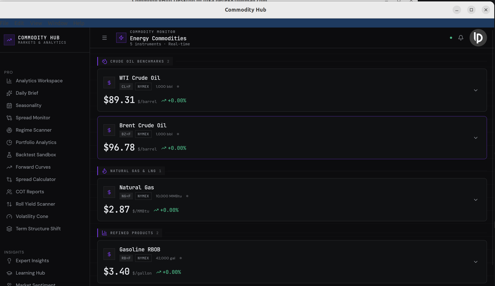

# CommodityHub Desktop

A native Qt6/C++ desktop client for [CommodityHub](https://commodity-hub.eu) — watchlists,
a price dashboard with charts, a portfolio tracker, and price alerts, all backed by the
same Supabase project as the web app. This is a separate codebase from the
`commodity-hub` web/Electron app, focused on the core workspace rather than full feature
parity.



## Requirements

- **Qt 6.2+** with the Core, Widgets, Network, and Charts modules
- **CMake 3.21+**
- A C++20 compiler (GCC 11+, Clang 14+, or MSVC 2022+)

## Building

### Linux (Debian/Ubuntu)

```bash
sudo apt-get install build-essential cmake qt6-base-dev qt6-base-dev-tools libqt6charts6-dev
```

```bash
cmake -B build -DCMAKE_BUILD_TYPE=Release
cmake --build build -j$(nproc)
```

The binary is `build/CommodityHubDesktop`.

### Windows

1. Install Qt 6 for MSVC via the [Qt Online Installer](https://www.qt.io/download-qt-installer), including the **Charts** module.
2. Install [CMake](https://cmake.org/download/) and Visual Studio 2022 (Desktop development with C++).
3. Configure and build, pointing CMake at your Qt install:
   ```powershell
   cmake -B build -DCMAKE_PREFIX_PATH="C:\Qt\6.x.x\msvc2022_64"
   cmake --build build --config Release
   ```
4. The executable is `build\Release\CommodityHub.exe` (the Windows build renames the
   target from `CommodityHubDesktop` to `CommodityHub` — see `CMakeLists.txt`). Qt's DLLs
   won't be on `PATH` by default; either run from a Qt command prompt, or run
   `windeployqt build\Release\CommodityHub.exe` to copy the needed DLLs alongside it.

### macOS

```bash
brew install qt cmake
cmake -B build -DCMAKE_PREFIX_PATH="$(brew --prefix qt)"
cmake --build build -j$(sysctl -n hw.ncpu)
```

## Running

```bash
./build/CommodityHubDesktop   # Linux/macOS
```

On first launch, a login dialog prompts for the CommodityHub account email/password
(same Supabase-backed accounts as the web app). The session is persisted afterward via
`QSettings` (organization "CommodityHub", application "CommodityHub Desktop"), so
subsequent launches skip straight to the main window.

## Configuration

The Supabase project URL and anon/publishable key are embedded in `src/core/Config.h` —
the same project the `commodity-hub` web app uses. The anon key is safe to ship
client-side; access is enforced by Postgres RLS policies on the backend, not by keeping
this key secret.

## Project layout

```
src/
  core/      Session persistence, Supabase REST client, app config
  models/    Data models (Commodity, Watchlist, Portfolio, PriceAlert, OhlcBar, ...)
  services/  Async fetch/mutate services wrapping the Supabase REST + Edge Function API
  ui/        QWidget-based panels, dialogs, and MainWindow
resources/   Fonts, theme stylesheet, Qt resource bundle
```
